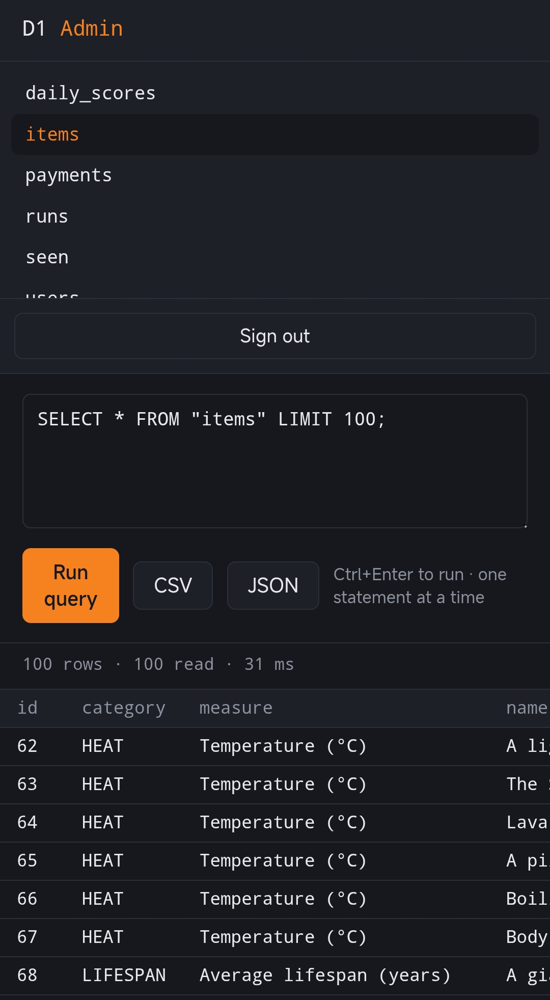

# D1 Admin

[](https://github.com/amirmahdavi2023/d1-admin/actions/workflows/test.yml)

**Manage your Cloudflare D1 databases from any browser — including your phone. No CLI, no build step, no dependencies.**

One file. Paste it into a Worker in the Cloudflare dashboard, bind your database, done. If you can open a browser, you can run this — no laptop, no terminal, no `wrangler` required.

Think phpMyAdmin, but for D1, living entirely inside your own Cloudflare account.



## Why

The dashboard's built-in D1 console is fine for a quick look, but painful for real work: no table browser, clunky query flow, nothing usable on a phone.

Every other D1 admin tool assumes you have a terminal and a Node toolchain. This one assumes nothing. I build and ship everything from an Android phone — `wrangler` was never an option for me, so I made the tool that doesn't need it. If it works from a phone, it works from anywhere.

Your data never touches a third-party service: the panel runs as a Worker inside your account, talking directly to your D1 binding.

## Features

- Browse all tables and views, tap to preview (`LIMIT 100`)
- Run any SQL statement — reads and writes — with timing and row counts
- Export query results to CSV or JSON — quoting handled, UTF-8 BOM so Excel/Sheets open non-Latin data cleanly
- Mobile-first UI that's actually pleasant on a small screen
- Token auth with constant-time comparison; token stored only in your browser
- Rejects multi-statement input with a clear error instead of D1's silent truncation — and does it correctly: semicolons inside string literals, quoted identifiers, and comments don't trip it, and a trailing `;` (even followed by a comment) is fine
- Zero dependencies, zero build step, one file of readable JavaScript
- The tricky part (SQL statement detection) is covered by [tests](test.mjs) that run in CI on every push
- Results are capped at 10,000 rows by default, with a one-click "run without limit" override
- Confirmation prompt before DROP, and DELETE/UPDATE without a WHERE clause

## Setup (2 minutes, entirely in the dashboard)

1. **Create a Worker.** Cloudflare dashboard → Workers & Pages → Create → Worker → deploy the hello-world, then click **Edit code**.
2. **Paste** the contents of [`worker.js`](worker.js), replacing everything. Deploy.
3. **Bind your database.** Worker → Settings → Bindings → Add → D1 database. Variable name must be `DB`.
4. **Set a token.** Worker → Settings → Variables and Secrets → Add → type **Secret**, name `ADMIN_TOKEN`, value: a long random string.
5. Open your Worker URL and sign in with the token.

That's the whole install. Steps 1–5 work fine from a phone browser.

## Security notes

- Anyone with the token has **full read/write access** to the database. Use a long random token and treat it like a password.
- The panel executes raw SQL by design — that's the point of an admin tool. Don't share the URL+token combination.
- Multi-statement input (`SELECT 1; DROP TABLE …`) is rejected server-side with an explicit error. Note that D1 itself would only run the first statement and silently drop the rest — the check here exists so you find out instead of assuming everything ran.
- For extra protection, put the Worker behind [Cloudflare Access](https://developers.cloudflare.com/cloudflare-one/policies/access/) (free for up to 50 users).

## Limitations 

- One SQL statement per run (D1 `prepare().all()` semantics)
- Table preview is capped at 100 rows — use `LIMIT`/`OFFSET` for paging
- No schema editor — use SQL directly, that's the point of the tool

## Development

No toolchain needed to use it — but if you're contributing, the statement validator has a dependency-free test suite:

```
node test.mjs
```

GitHub Actions runs it automatically on every push and PR.

## License

MIT


## ⭐ Support

If D1 Admin saved you time, a star helps other Cloudflare developers find it.

**[→ Star this repo](https://github.com/amirmahdavi2023/d1-admin)**
